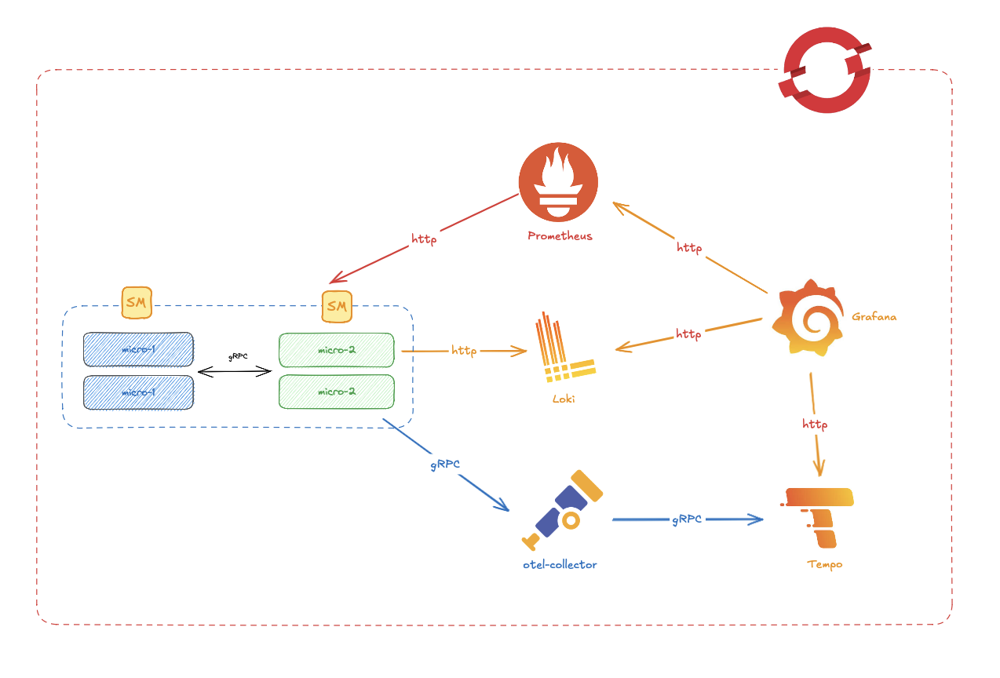
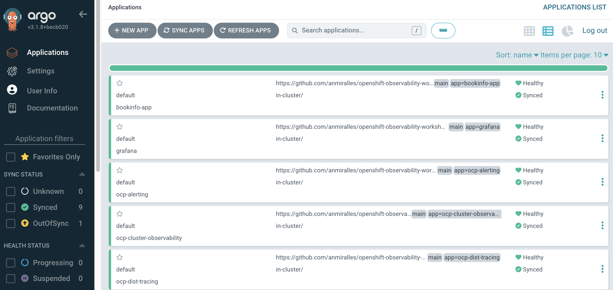
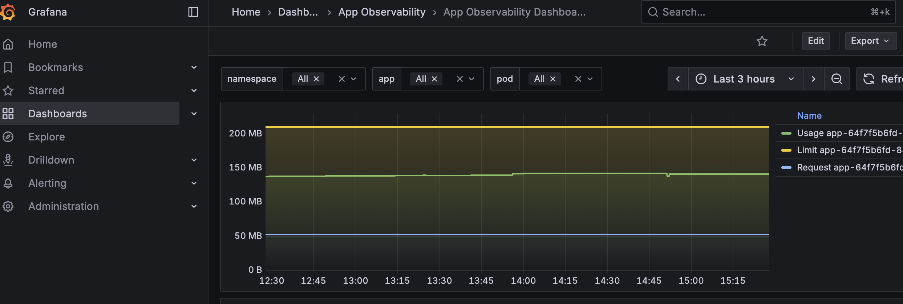
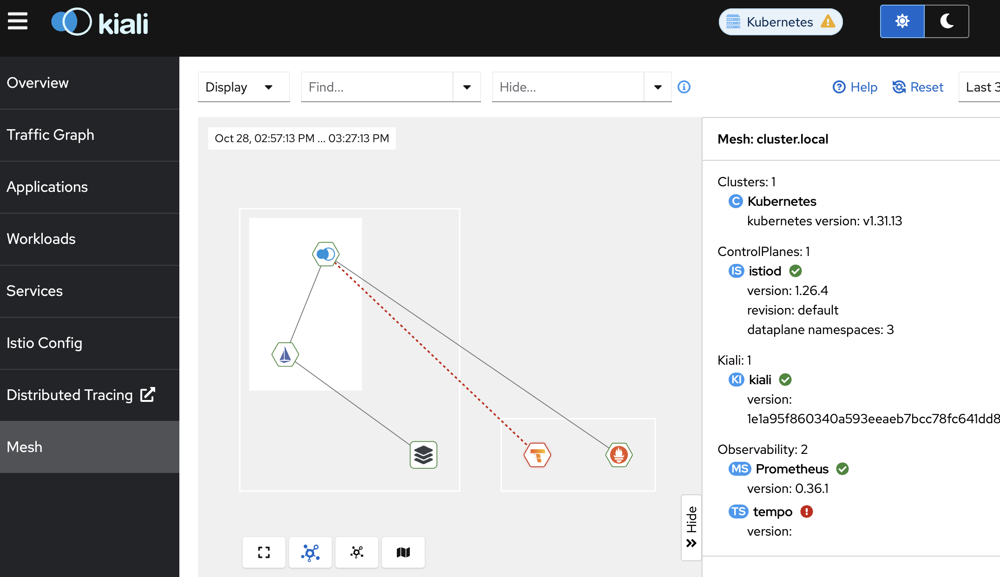

# OpenShift Observability Workshop

A comprehensive observability stack for OpenShift Container Platform using GitOps (ArgoCD) for deployment and management. This workshop demonstrates a complete end-to-end observability solution including logging, distributed tracing, monitoring, network observability, and service mesh.

This repo is based on Alvaro Lopez previous work about the same topic. You can see it in this [link](https://github.com/alvarolop/quarkus-observability-app).

## Table of Contents

- [Architecture](#architecture)
- [Prerequisites](#prerequisites)
- [Quick Start](#quick-start)
- [Observability Stack Components](#observability-stack-components)
- [GitOps Structure](#gitops-structure)
- [Post-Installation](#post-installation)
- [Common Operations](#common-operations)

## Architecture

This repository implements an **App of Apps** pattern using ArgoCD, where a root application manages multiple child applications. Each component of the observability stack is deployed as a separate ArgoCD application, ensuring modular and declarative infrastructure management.

### High-Level Architecture

The following image represents the architecture of the solution:



### Infrastructure Scheduling

All observability components are configured to run on infrastructure nodes with appropriate tolerations:

```yaml
tolerations:
  - effect: NoSchedule
    key: node-role.kubernetes.io/infra
    value: reserved
  - effect: NoExecute
    key: node-role.kubernetes.io/infra
    value: reserved
```

## Prerequisites

Before running the installation scripts, ensure you have:

1. **OpenShift Cluster Access**
   ```bash
   oc login --token=<your-token> --server=<your-server>
   ```

2. **AWS CLI** (for S3 bucket creation)
   ```bash
   aws --version
   ```

3. **AWS Credentials File** - Create `aws-env-vars` file in the root directory:
   ```bash
   export AWS_ACCESS_KEY_ID=your-access-key
   export AWS_SECRET_ACCESS_KEY=your-secret-key
   export AWS_REGION=us-east-1
   ```

4. **Gmail App Credentials** (Optional - for alerting) - Create `gmail-app-vars` file:
   ```bash
   export GMAIL_ACCOUNT=your-email@gmail.com
   export GMAIL_AUTH_TOKEN=your-app-password
   ```

## Quick Start

### Step 1: Install GitOps Operator and ArgoCD

```bash
./install-gitops.sh
```

This script:
- Installs the OpenShift GitOps operator
- Deploys an ArgoCD instance in the `openshift-gitops` namespace

### Step 2: Deploy Observability Stack

```bash
./install-observability.sh
```

This script:
- Labels worker nodes as infrastructure nodes
- Creates S3 buckets for Loki, Tempo, and Network Observability
- Creates Kubernetes secrets for S3 access
- Triggers ArgoCD to deploy all observability components

## Observability Stack Components

The observability stack is organized under `gitops/cluster-services/` with the following components:

### 1. Logging Stack (`ocp-logging/`)

Complete logging solution using the Cluster Logging Operator and Loki.

**Components:**
- **01-clo-operator/** - Cluster Logging Operator for managing log collection
- **02-loki-operator/** - Loki Operator for log aggregation backend
- **03-cluster-logging/** - Log forwarding configuration and RBAC
  - `ClusterLogForwarder` - Routes logs from different sources (application, infrastructure, audit)
  - ServiceAccounts and ClusterRoleBindings for log collection
  - Log File Metrics Exporter (LFME) for exposing log metrics
- **04-loki/** - LokiStack instance
  - Storage: S3-backed (`s3-bucket-loki` secret)
  - Size: `1x.demo` (minimal deployment for testing)
  - Retention: 7 days global retention
  - Storage Class: `gp3-csi` (can be changed to ODF)

**Features:**
- Collects application, infrastructure, and audit logs
- Stores logs in S3 for durability
- Integrates with Grafana for visualization
- Supports log querying via LogQL

### 2. Distributed Tracing (`ocp-dist-tracing/`)

End-to-end distributed tracing using Tempo and OpenTelemetry.

**Components:**
- **01-tempo-operator/** - Tempo Operator for trace storage backend
- **02-opentelemetry-operator/** - OpenTelemetry Operator for trace collection
- **03-otel/** - OpenTelemetry Collector configuration
  - Collector instance for receiving traces
  - RBAC for trace writing (dev and prod tenants)
  - ServiceAccounts and ClusterRoleBindings
- **04-tempo/** - TempoStack instance
  - Storage: S3-backed (`s3-bucket-tempo` secret)
  - Multi-tenant support (dev and prod)
  - Jaeger Query UI for trace visualization
  - RBAC for trace reading

**Features:**
- Distributed tracing across microservices
- OpenTelemetry-based instrumentation
- Jaeger UI integration
- S3 storage for trace data
- Multi-tenancy support

### 3. Monitoring (`ocp-monitoring/`)

Built-in OpenShift monitoring using Prometheus.

**Components:**
- `cm-cluster-monitoring-config.yaml` - Cluster monitoring configuration
- `cm-user-workload-monitoring-config.yaml` - User workload monitoring
- `secret-alertmanager-main.yaml` - AlertManager configuration

**Features:**
- Prometheus for metrics collection
- User workload monitoring enabled
- Integration with Grafana
- AlertManager for alert routing

### 4. Grafana (`grafana/`)

Unified visualization platform for metrics, logs, and traces.

**Components:**
- **01-operator/** - Grafana Operator installation
- **02-grafana/** - Grafana instance with OAuth proxy
  - OAuth integration with OpenShift
  - ClusterRoleBindings for cluster monitoring access
  - TLS certificate injection
- **03-datasource/** - Preconfigured datasources
  - Prometheus (metrics)
  - Loki (logs)
  - Tempo (traces)
- **04-dashboard/** - Custom dashboards
  - Quarkus Observability dashboard
- **05-grafana-tempo/** - Tempo operational dashboards
  - Tempo Operational
  - Tempo Reads/Writes
  - Tempo Resources
  - Tempo Rollout Progress
  - Tempo Tenants

**Features:**
- Single pane of glass for all observability data
- OpenShift OAuth integration
- Pre-configured datasources
- Custom and operational dashboards
- Correlation between metrics, logs, and traces

### 5. Cluster Observability (`ocp-cluster-observability/`)

Enhanced OpenShift Console UI plugins for observability.

**Components:**
- **01-operator/** - Cluster Observability Operator
- **02-uiplugins/** - Console UI plugins
  - Distributed Tracing plugin
  - Logging plugin
  - Monitoring plugin
  - Troubleshooting Panel plugin

**Features:**
- Native OpenShift Console integration
- Enhanced troubleshooting capabilities
- Unified observability experience

### 6. Network Observability (`ocp-network-observability/`)

Network flow monitoring and analysis using eBPF.

**Components:**
- `FlowCollector` - Network flow collection configuration
- Kafka integration for flow data streaming
- LokiStack integration for flow storage
- S3 storage backend (`s3-bucket-net-obs` secret)

**Features:**
- eBPF-based network flow collection
- Network topology visualization
- Flow data analysis
- S3 storage for historical data
- Integration with OpenShift Console

### 7. Service Mesh v3 (`ocp-servicemesh3/`)

Istio-based service mesh for microservices communication.

**Components:**
- **01-servicemesh-operator/** - Service Mesh Operator subscription
- **02-servicemesh/** - Istio control plane and data plane
  - Istio control plane (`Istio` CR)
  - Istio CNI (`IstioCNI` CR)
  - Ingress Gateway (`IstioIngressGateway` CR)
  - Telemetry configuration (`IstioTelemetry` CR)
  - ServiceMonitor and PodMonitor for metrics
- **03-kiali-operator/** - Kiali Operator for service mesh visualization
- **04-Kiali/** - Kiali instance with OSSMC integration

**Features:**
- Traffic management and routing
- mTLS encryption between services
- Observability (metrics, logs, traces)
- Kiali dashboard for service mesh visualization
- Integration with Prometheus and Grafana

### 8. Alerting (`ocp-alerting/`)

Alert routing and notification configuration.

**Components:**
- `alertmanagerconfig-alert-routing-to-mail.yaml` - Email alert routing
- `alertmanagerconfig-alert-routing-to-mail-label.yaml` - Label-based routing

**Features:**
- Gmail integration for alert notifications
- Label-based alert routing
- Integration with AlertManager

### Access the UIs

After installation, access the following web interfaces:

1. **ArgoCD**
   ```bash
   oc get route argocd-server -n openshift-gitops
   ```
   

2. **Grafana**
   ```bash
   oc get route grafana-route -n grafana
   ```
   

3. **Jaeger UI** (Tempo)
   ```bash
   oc get route tempo-tempostack-gateway -n openshift-tempo
   ```

4. **Kiali** (Service Mesh)
   ```bash
   oc get route kiali -n istio-system
   ```
    

## Sample Applications

The repository includes two sample applications for testing observability:

1. **Quarkus Observability App** (`gitops/applications/quarkus-observability-app/`)
   - Instrumented Quarkus application
   - Demonstrates metrics, logs, and traces integration

2. **Bookinfo** (`gitops/applications/bookinfo/`)
   - Classic microservices demo application
   - Service mesh demonstration
   - Multi-service tracing example

## Resources

- [OpenShift GitOps Documentation](https://docs.openshift.com/gitops/)
- [OpenShift Observability Documentation](https://docs.redhat.com/fr/documentation/red_hat_openshift_observability/1)
- [OpenShift Logging Documentation](https://docs.redhat.com/en/documentation/red_hat_openshift_logging/6.3)
- [OpenShift OTEL Documentation](https://docs.redhat.com/fr/documentation/openshift_container_platform/4.18/html/red_hat_build_of_opentelemetry/otel-architecture)
- [Openshift Service Mesh Documentation](https://docs.redhat.com/en/documentation/red_hat_openshift_service_mesh/3.1)
- [ArgoCD Documentation](https://argo-cd.readthedocs.io/)

## License

This project is for workshop and educational purposes.